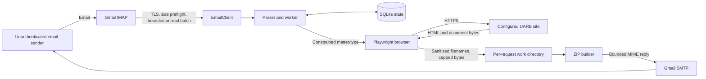

# Senpilot Agent Threat Model

## Executive summary

Senpilot Agent has a small attack surface, but its public email trigger lets an unauthenticated Internet sender cause browser automation, remote downloads, ZIP creation, and outbound email. The highest residual risk is therefore resource abuse rather than direct code execution. The implementation now bounds unread-message fetches, rejects inbound messages over 1 MB before downloading their MIME bodies, caps concurrency/files/attachment size, enforces sender and global hourly quotas, sanitizes every remote filename before filesystem use, runs the container as a non-root user, pins runtime dependencies, and restricts local credential/database ACLs.

No critical or high-confidence exploitable vulnerability was found in the current source. The main residual risks are distributed mailbox abuse, forwarding malicious content if the trusted UARB source is compromised, the normal SMTP-accepted/database-not-yet-updated duplicate-reply window, and unverified OS-package CVEs in the Playwright base image.

## Scope and assumptions

In scope: `src/`, `Dockerfile`, Python dependency files, `.env.example`, the SQLite state model, Gmail IMAP/SMTP integration, Playwright interaction with the configured UARB site, downloaded files, and generated ZIP/email output.

Working assumptions communicated to the owner and not corrected:

- The mailbox is reachable from the public Internet.
- Deployment is one local process or one container, not a multi-tenant service.
- The configured UARB FileMaker site is the only intended download origin and its documents are public.
- The service does not intentionally retain private business documents after sending a reply.
- Host administrators and the process identity are trusted; a full host compromise is out of scope.

The review used source inspection plus Ruff, mypy, Bandit, pip-audit, detect-secrets, pytest, Docker build/run checks, complexity/dead-code scans, and Windows ACL inspection. Docker Scout could not enumerate base-image CVEs without a Docker account, so OS-package vulnerability status remains unverified.

## System model

### Primary components

- `src/email_client.py::EmailClient`: authenticates to Gmail, searches unread messages, performs RFC822 size preflight, parses MIME content, marks handled messages read, and sends replies.
- `src/main.py::poll_forever` / `handle_message`: concurrency control, sender filtering/rate limiting, idempotent state changes, retry policy, cleanup, and reply selection.
- `src/state.py::StateStore`: SQLite idempotency key, request lease/state, retry, and rate-limit history.
- `src/request_parser.py::parse_request`: converts untrusted subject/body text into a constrained matter number and document-type enum.
- `src/uarb_client.py::UARBClient`: drives Chromium against the configured UARB FileMaker site and downloads documents.
- `src/archive.py`: sanitizes filenames and creates the outbound ZIP.
- `Dockerfile`: runtime boundary and process identity.

### Data flows and trust boundaries

1. An unauthenticated sender submits an email to Gmail.
2. The agent crosses the Gmail trust boundary with an App Password and reads bounded unread messages over TLS.
3. The parser reduces untrusted text to a constrained request; SQLite records its idempotency state.
4. Playwright crosses the Internet boundary to the configured UARB endpoint and receives page content and files.
5. Remote filenames and bytes cross into the local work directory, are sanitized/capped, then archived.
6. The agent sends a generated reply and optional ZIP back through Gmail SMTP, then removes per-request work files.

#### Diagram

Trust boundaries are: public sender to Gmail; Gmail to the authenticated agent; local agent/browser to UARB; remote document bytes to the local filesystem and outbound email; container/process to the host filesystem.

## Assets and security objectives

- Gmail App Password: preserve confidentiality and prevent unauthorized mailbox access or sending.
- Mailbox reputation/quota: prevent reply loops, spam amplification, and excessive IMAP/SMTP usage.
- Host/container resources: bound CPU, memory, disk, browser processes, bandwidth, and request duration.
- State integrity: prevent duplicate/concurrent processing and retain an auditable terminal state.
- Output integrity: send only files associated with the requested matter/type, avoid path escape, and never send partial/corrupt archives.
- User safety: do not execute downloaded documents and clearly treat the UARB site as the content authority.

## Attacker model

### Capabilities

- Send arbitrary subject/body/MIME content and headers to the public mailbox, including many messages, spoof-like display names, malformed messages, and oversized messages.
- Use multiple sender addresses to evade a per-address rate limit.
- Trigger supported matter/document requests and observe replies sent to addresses parsed by Gmail/Python email handling.
- Influence filenames and file bytes only if UARB data is malicious or the UARB site/path is compromised.
- Cause network timeouts, partial downloads, process interruption, or races around external service availability.

### Non-capabilities

- Change environment variables, the configured UARB URL, local files, ACLs, or container configuration through an email request.
- Supply arbitrary URLs, shell commands, Python expressions, document-type strings, or filesystem paths to the browser pipeline.
- Read SQLite state, credentials, work files, or logs without local host/process access.
- Directly make the service execute or unpack downloaded document content.

## Entry points and attack surfaces

- IMAP message discovery and MIME parsing: `src/email_client.py::fetch_unread`, `_body_text`.
- Sender/header policy and parser: `src/main.py::_is_automated_sender`, `src/request_parser.py::parse_request`.
- Rate limit, retry, idempotency, and stale-work recovery: `src/state.py`, `src/main.py::handle_message`.
- Remote browser/UI content: `src/uarb_client.py` selectors, metadata extraction, download dialogs, and timeouts.
- Filename and ZIP boundary: `src/archive.py::sanitize_filename`, `create_zip`.
- SMTP reply construction and attachment loading: `src/email_client.py::reply`.
- Deployment/runtime supply chain: `Dockerfile`, `requirements.txt`.
- Local secrets and metadata: `.env`, `state.db`, runtime logs and `/data` volume.

## Top abuse paths

1. **Distributed resource exhaustion:** many addresses submit valid requests and consume browser, UARB, Gmail, bandwidth, and disk resources. Worker/file/message/time limits and the global hourly quota bound impact, but there is no authenticated allowlist.
2. **Compromised upstream content relay:** a compromised UARB origin supplies hostile document bytes. The agent does not execute them, but packages and emails them to the requester, potentially lending trust to malicious content.
3. **Mailbox credential theft from the host:** a local user/process obtains the App Password and controls IMAP/SMTP. File ACLs and a dedicated account reduce exposure; a host/process compromise still defeats those controls.
4. **Crash-induced duplicate reply:** SMTP accepts a message, then the process stops before SQLite reaches `SENT`. Recovery may send the reply again because SMTP and SQLite cannot share one transaction.
5. **Base-image vulnerability exposure:** a vulnerable OS/browser library in the Playwright image is reached by malicious remote web content. The process is non-root, but base-image CVEs require continued tracking.

## Threat model table

| ID | Threat / abuse scenario | Preconditions | Impacted assets | Existing controls and evidence | Residual risk | Recommended follow-up |
|---|---|---|---|---|---|---|
| TM-01 | Many valid emails exhaust browser, network, Gmail, or UARB capacity | Public mailbox; attacker can rotate senders | Availability, quota, reputation | Bounded fetch in `poll_forever`; `MAX_INBOUND_BYTES`; `MAX_WORKERS`; per-sender and global hourly limits; file/attachment caps; network/download timeouts | Low-Medium | Add an optional sender allowlist if the mailbox is intended for a closed user group |
| TM-02 | Oversized/malformed MIME consumes memory before policy checks | Attacker can email mailbox | Memory, availability | `EmailClient.fetch_unread` issues `RFC822.SIZE` before `BODY.PEEK[]`, marks oversize mail read, and limits each poll batch; regression test in `tests/test_email_client.py` | Low | Monitor ignored-size counts and tune the 1 MB default if legitimate requests include attachments |
| TM-03 | Remote filename escapes the work directory or uses a Windows device name | UARB filename is malicious | Filesystem integrity, availability | `UARBClient._download_row_once` calls `sanitize_filename` before path construction; length, separator, control character, and reserved-device handling in `src/archive.py` | Low | Keep the filename tests when changing download logic |
| TM-04 | Compromised UARB serves a malicious document that is forwarded to users | Upstream/site compromise | User safety, trust | Fixed configured origin; no downloaded file execution; byte/ZIP caps; per-request cleanup | Medium | Add MIME/magic allowlisting or a malware scanner if document formats can be enumerated reliably |
| TM-05 | App Password or request metadata is read by another local user | Shared/compromised Windows host | Mailbox confidentiality/integrity, sender metadata | `.env` is git-ignored; dedicated App Password; explicit ACLs on `.env` and `state.db`; credentials/bodies are not logged | Medium | Run under a dedicated OS/service account and rotate the App Password after any suspected host exposure |
| TM-06 | Container compromise gains root-level container privileges | Browser/runtime exploit | Host-mounted data, container integrity | `Dockerfile` creates UID 10001 and uses `USER agent`; live test confirmed Chromium launch and `/data` write as non-root | Low | Use a read-only root filesystem and drop Linux capabilities in the deployment command/platform |
| TM-07 | SMTP success followed by pre-commit crash causes duplicate replies | Failure in the narrow SMTP/SQLite window | Recipient experience, quota | SQLite idempotency and active-state recovery; limitation documented in `README.md` | Low | Add a deterministic outbound ID plus provider-side sent-message reconciliation if duplicates become material |
| TM-08 | State/log growth or abandoned files consume disk | Long-lived deployment or hard crash | Availability, metadata retention | Normal paths delete per-request work in `handle_message` `finally`; SQLite stores bounded error text | Low | Add periodic SQLite/log retention and startup cleanup for orphaned work directories |
| TM-09 | Vulnerable dependency or Playwright base image is exploited | Published package/image flaw plus reachable vector | Process/container integrity | Exact Python runtime pins; pip-audit found no known runtime CVEs; non-root runtime | Medium (uncertain) | Add authenticated Docker Scout/Trivy scanning and scheduled image rebuilds; OS-layer status was not verified in this review |

## Criticality calibration

- **Critical:** direct credential disclosure, arbitrary host code execution, or unrestricted filesystem escape that is practical from one unauthenticated email.
- **High:** reliable mailbox takeover, cross-boundary code execution inside the deployed container with meaningful mounted-data impact, or easy sustained service outage with no effective bounds.
- **Medium:** meaningful abuse that needs volume, multiple identities, upstream compromise, local access, or a narrow failure window; controls reduce but do not eliminate impact.
- **Low:** defense-in-depth gap, limited duplicate/availability issue, or scenario requiring already-privileged local access with little additional gain.

## Focus paths for security review

- `src/email_client.py`: keep size preflight before body fetch, preserve bounded batching, and avoid logging message bodies or credentials.
- `src/main.py`: verify every terminal branch updates state intentionally, cleans work files, and marks mail read only when retry is unnecessary.
- `src/state.py`: review atomic claim/reclaim behavior before adding multiple processes or hosts.
- `src/uarb_client.py`: treat all page text, counts, filenames, and downloads as untrusted; preserve the fixed-origin design and pre-write sanitization.
- `src/archive.py`: preserve path-neutral member names and add format/content validation here if policy becomes known.
- `Dockerfile` and `requirements.txt`: keep exact pins, non-root execution, current browser image, and automated image/package scanning.
- Deployment configuration: add a global quota/allowlist, read-only root filesystem, dropped capabilities, log rotation, and orphan cleanup for Internet-facing production use.
